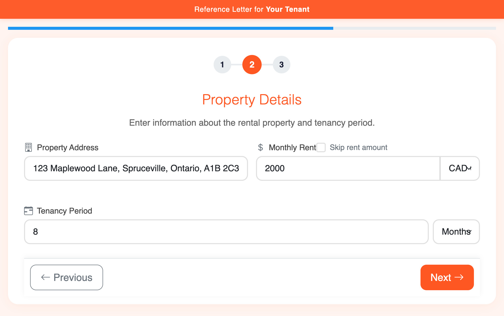

# SolidRef Rental Reference Generator

SolidRef is a project I quickly developed while searching for a new place. When I reached out to my previous landlords, they all mentioned being too busy to write a letter for me. As a result, I created SolidRef to be as straightforward as possible. I deployed it at my personal website and shared the link with them. It is a practical tool for tenants to share with their landlords for quicker letter generation.

## About the App
SolidRef Rental Reference Generator is a web-based, mobile-first tool designed to help landlords create professional reference letters for their tenants. It offers a multi-step form interface, multiple letter templates, and PDF generation capabilities. The tool is mobile-responsive, ensuring ease of use across devices, and includes share functionality, allowing landlords to easily share the generated reference letter.

## How to Use
To use the app, send the URL "your-domain.com/?tenant=YOUR%20NAME" to your landlord. The landlord will then fill out a simple three-step form, allowing them to generate and customize a reference letter. Once the letter is ready, the landlord can share the customized PDF with you.

## Deployment Steps

### Option 1: Basic Static Hosting
1. Upload these files to any static web host:
   - index.html
   - script.js
   - styles.css

Recommended hosts:
- GitHub Pages
- Netlify
- Vercel

### Option 2: Local Development
1. Clone the repository
2. Use a local server (e.g., Python's `http.server` or Node's `http-server`)
3. Access via `localhost`

   (If you have a configured browser, you can also just double-click the index.html to test it.)

### Requirements
- Modern web browser
- Internet connection (for CDN resources)

No sensitive data is stored, as all processing occurs client-side. PDF generation is done locally, so no information is transmitted or stored externally.

# Screenshots Gallery

